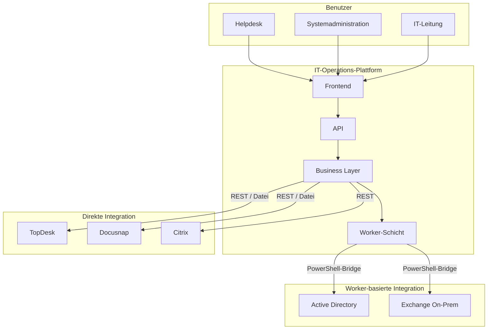

# ARCHITECTURE.md
# Architekturhandbuch — IT-Operations-Plattform

---

## 1. Einleitung

### Zweck dieses Dokuments

Dieses Dokument beschreibt die Architektur der IT-Operations-Plattform. Es definiert die grundlegenden Prinzipien, Verantwortlichkeiten und Strukturen, die für die Entwicklung und Weiterentwicklung der Plattform verbindlich sind.

Die Architektur folgt konsequent dem Leitsatz „Systeme verbinden, nicht ersetzen." Alle beschriebenen Komponenten und Architekturentscheidungen unterstützen dieses Grundprinzip.

`ARCHITECTURE.md` ist das architektonische Fundament der gesamten Projektdokumentation. Alle anderen technischen Dokumente bauen auf diesem Dokument auf und vertiefen einzelne Aspekte — sie ergänzen es, ersetzen es jedoch nicht.

### Abgrenzung

Dieses Dokument beschreibt die dauerhafte Zielarchitektur der Plattform. Es enthält bewusst keine Implementierungsdetails, Konfigurationswerte, Versionsnummern oder offene Entwicklungspunkte. Diese Inhalte gehören in die jeweils zuständigen Dokumente:

| Thema | Zuständiges Dokument |
|---|---|
| Infrastruktur, Verbindungsdetails, Umgebungsvariablen | `TECHNICAL.md` |
| API-Endpunkte, Parameter, Rückgabewerte | `API.md` |
| Sicherheitsimplementierung, RBAC-Konfiguration | `SECURITY.md` |
| Installation, Deployment, Systemvoraussetzungen | `DEPLOYMENT.md` |
| Betrieb, Fehlerdiagnose, Monitoring | `OPERATIONS.md` |
| Historische Architekturentscheidungen | `DECISIONS.md` |
| Wiederkehrende Implementierungsmuster | `PATTERNS.md` |
| Geplante Weiterentwicklung | `ROADMAP.md` |

### Zielgruppe

Dieses Dokument richtet sich an neue Entwickler, Systemadministratoren, zukünftige Maintainer und technische Projektverantwortliche, die die Plattform verstehen, weiterentwickeln oder betreiben möchten. Es setzt grundlegende Kenntnisse der eingesetzten Technologien voraus und dient nicht als Benutzer- oder Installationshandbuch.

### Zeitlosigkeit als Gestaltungsprinzip

Dieses Dokument ist bewusst zeitlos formuliert. Es beschreibt die strukturellen Grundlagen der Plattform, nicht ihren momentanen Implementierungsstand. Einzelne Komponenten können erweitert, neue Integrationen hinzugefügt und bestehende Module überarbeitet werden — die in diesem Dokument beschriebene Architektur bleibt dabei der gültige Rahmen. Ziel ist es, dass dieses Dokument auch über mehrere Versionen hinweg weitgehend unverändert gültig bleibt.

Wenn eine Erweiterung grundlegende Architekturprinzipien berührt oder neue Strukturentscheidungen erfordert, wird dieses Dokument entsprechend angepasst. Alle anderen Änderungen werden in den zuständigen Spezialdokumenten nachgeführt.

---

## 2. Architekturvision

### Das Grundprinzip

Die IT-Operations-Plattform verbindet bestehende IT-Systeme zu einer gemeinsamen Arbeitsumgebung. Sie ersetzt keine vorhandenen Fachanwendungen, sondern tritt als ausführender Layer zwischen diese Systeme und ihre Benutzer.

Active Directory, Exchange, TopDesk und Docusnap bleiben die führenden Systeme (*Source of Truth*) ihres jeweiligen Aufgabenbereichs. Die Plattform führt ihre Informationen zusammen, unterstützt bereichsübergreifende Arbeitsabläufe und reduziert Medienbrüche — ohne die fachliche Verantwortung der angebundenen Systeme zu übernehmen.

### Systemübersicht



Die Plattform steht zwischen den Benutzern und den externen Systemen. Benutzer interagieren ausschließlich mit der Plattform. Die Plattform kommuniziert mit den externen Systemen — nicht umgekehrt. Dadurch bleiben die einzelnen Integrationen unabhängig voneinander und können einzeln erweitert oder ausgetauscht werden.

### Die Plattform als Integrationsschicht

Die Plattform erfüllt drei klar abgegrenzte Aufgaben:

**Informationen zusammenführen.**
Daten aus verschiedenen Systemen werden in einem gemeinsamen Kontext dargestellt. Der Benutzer erhält eine konsolidierte Sicht, ohne selbst zwischen Anwendungen wechseln zu müssen.

**Workflows unterstützen.**
Wiederkehrende administrative Abläufe, die mehrere Systeme betreffen, werden durch die Plattform koordiniert. Die Plattform führt aus, was der Benutzer freigibt — sie entscheidet nicht eigenständig. Die Ausführung erfolgt nachvollziehbar, protokolliert und unter Berücksichtigung der jeweiligen Berechtigungen.

**Medienbrüche reduzieren.**
Aufgaben, die bisher den parallelen Einsatz mehrerer Fachanwendungen erforderten, können über eine gemeinsame Oberfläche durchgeführt werden.

### Was die Plattform bewusst nicht ist

Die Plattform ist kein Ersatz für die angebundenen Systeme. Sie führt keine eigene Benutzerverwaltung, kein eigenes Ticketsystem und kein eigenes Asset-Management-System. Alle fachlichen Entscheidungen verbleiben in den führenden Systemen.

Diese Grenze ist architektonisch verbindlich. Sie schützt die Plattform vor unkontrolliertem Wachstum und stellt sicher, dass sie langfristig wartbar und fokussiert bleibt. Neue Anforderungen werden deshalb grundsätzlich darauf geprüft, ob sie bestehende Systeme sinnvoll verbinden oder beginnen würden, deren Fachverantwortung zu übernehmen.

---

## 3. Architekturprinzipien

Die folgenden Prinzipien sind verbindlich. Sie leiten alle Architektur- und Entwicklungsentscheidungen und gelten für die gesamte Laufzeit des Projekts. Neue Funktionen, Integrationen und strukturelle Änderungen werden an diesen Prinzipien gemessen.

`DECISIONS.md` dokumentiert konkrete Architekturentscheidungen und verweist dabei auf die jeweils zugrundeliegenden Prinzipien.

---

### Prinzip 1 — Systeme verbinden, nicht ersetzen

**Beschreibung:**
Die Plattform tritt als Integrationsschicht zwischen bestehende Fachanwendungen und ihre Benutzer. Sie bildet keine Funktionen bestehender Systeme nach und übernimmt keine fachliche Verantwortung, die einem externen System zugeordnet ist.

**Konsequenz:**
Active Directory bleibt die führende Instanz für Identitäten. Exchange bleibt die führende Instanz für Mailboxen. TopDesk bleibt die führende Instanz für Serviceprozesse. Docusnap bleibt die führende Instanz für Asset-Inventar. Die Plattform liest, koordiniert und schreibt zurück — sie führt keine eigenen parallelen Datenbestände für diese Bereiche.

**Begründung:**
Doppelte Datenhaltung erzeugt Inkonsistenzen. Nachgebaute Funktionen erzeugen Wartungsaufwand ohne Mehrwert. Die Stärke der Plattform liegt in der Verbindung bestehender Systeme, nicht in ihrer Ablösung.

---

### Prinzip 2 — Führende Systeme respektieren

**Beschreibung:**
Jedes externe System ist die alleinige *Source of Truth* für seinen Aufgabenbereich. Die Plattform leitet Informationen aus diesen Systemen ab, überschreibt sie jedoch nur dann, wenn der Benutzer eine explizite administrative Aktion ausführt.

**Konsequenz:**
Die Plattform hält keine eigenen Schattenkopien von AD-Benutzerdaten, Exchange-Konfigurationen oder TopDesk-Tickets. Lesezugriffe gehen gegen die Quellsysteme. Schreibzugriffe erfolgen ausschließlich über definierte, autorisierte Operationen. Eigene Daten werden ausschließlich gespeichert, wenn sie keinen führenden Datenbestand eines externen Systems ersetzen — etwa für die Change-Queue, das Audit-Log oder organisatorische Konfiguration.

**Begründung:**
Schattenkopien veralten, divergieren und erzeugen Vertrauen in falsche Daten. Das Respektieren führender Systeme ist die Grundlage für Zuverlässigkeit und Nachvollziehbarkeit.

---

### Prinzip 3 — Lose Kopplung der Module

**Beschreibung:**
Jede Integration und jedes Modul der Plattform funktioniert unabhängig von den anderen. Der Ausfall oder die Nichtverfügbarkeit eines externen Systems darf andere Module nicht blockieren.

**Konsequenz:**
AD, Exchange, TopDesk und Docusnap sind voneinander unabhängige Integrationen. Der Ausfall einer Integration darf ausschließlich die Funktionen dieser Integration betreffen — eine nicht erreichbare Exchange-Instanz beeinträchtigt nicht die AD-Funktionen. Module werden so entwickelt, dass sie einzeln getestet, erweitert und ausgetauscht werden können.

**Begründung:**
Enge Kopplung zwischen Modulen führt zu Kaskadenausfällen und erschwert die Weiterentwicklung erheblich. Lose Kopplung schützt die Stabilität der Gesamtplattform und senkt den Aufwand für zukünftige Änderungen.

---

### Prinzip 4 — Permissions statt Rollen

**Beschreibung:**
Die API-Schicht prüft ausschließlich einzelne Permissions, niemals Rollennamen. Rollen sind ein Bündelungskonzept für Permissions — sie existieren in der Konfiguration, nicht im Anwendungscode.

**Konsequenz:**
Kein Anwendungscode enthält Bedingungen der Form "wenn Rolle gleich it-admin". Stattdessen prüft jeder Endpunkt genau die Permission, die er benötigt. Die Zuordnung von Rollen zu Permissions ist konfigurierbar und erfordert keine Code-Änderung.

**Begründung:**
Rollenbasierte Prüfungen im Code führen zu hartcodierten Abhängigkeiten zwischen Geschäftslogik und Berechtigungsstruktur. Permission-basierte Prüfungen entkoppeln diese Ebenen und ermöglichen flexible Anpassungen ohne Codeänderungen.

---

### Prinzip 5 — Konfiguration außerhalb des Codes

**Beschreibung:**
Werte, die sich zwischen Umgebungen unterscheiden oder sich im Betrieb ändern können, gehören nicht in den Anwendungscode. Dazu zählen Verbindungsparameter, Schwellenwerte, systemspezifische Bezeichnungen und Berechtigungszuordnungen.

**Konsequenz:**
Der Anwendungscode ist umgebungsunabhängig. Eine Änderung an Verbindungsdaten, Rollenzuordnungen oder Systemparametern erfordert keinen neuen Build und keinen Code-Commit. Sicherheitsrelevante Konfigurationswerte werden zusätzlich entsprechend der Sicherheitsarchitektur geschützt und niemals im Klartext gespeichert. Details dazu sind in `SECURITY.md` beschrieben.

**Begründung:**
Konfiguration im Code erzeugt Deploymentrisiken, erschwert Umgebungswechsel und verleitet dazu, sicherheitsrelevante Werte in Versionskontrollsystemen abzulegen.

---

### Prinzip 6 — Nachvollziehbarkeit vor Automatisierung

**Beschreibung:**
Automatisierung dient der Unterstützung administrativer Abläufe, ersetzt jedoch keine bewussten Entscheidungen. Kritische Operationen werden nicht ohne explizite Benutzeraktion ausgeführt. Jede ausgeführte Aktion wird protokolliert.

**Konsequenz:**
Prozesse wie die Ausführung von TopDesk-Changes erfordern eine manuelle Freigabe. Automatische Hintergrundprozesse beschränken sich auf das Laden und Aufbereiten von Daten. Das Audit-Log erfasst alle administrativen Aktionen mit Zeitstempel, Benutzer und Ergebnis.

**Begründung:**
Vollständige Automatisierung ohne Kontrollmöglichkeit erzeugt Intransparenz und entzieht Administratoren die Verantwortung über kritische Systemänderungen. Vertrauen in eine Plattform entsteht durch Nachvollziehbarkeit, nicht durch Geschwindigkeit.

---

### Prinzip 7 — Bestehende Patterns bevorzugen

**Beschreibung:**
Neue Funktionen und Integrationen werden nach dem Vorbild bereits etablierter Strukturen entwickelt. Neue Architekturmuster werden nur eingeführt, wenn bestehende nachweislich ungeeignet sind.

**Konsequenz:**
Eine neue Integration folgt dem gleichen Aufbau wie bestehende Integrationen. Ein neuer API-Endpunkt folgt dem gleichen Muster wie bestehende Endpunkte. Abweichungen werden explizit begründet und in `DECISIONS.md` dokumentiert.

**Begründung:**
Konsistente Patterns reduzieren den kognitiven Aufwand beim Lesen und Erweitern des Codes erheblich. Inkonsistente Strukturen entstehen häufig nicht durch bewusste Entscheidungen, sondern durch fehlende Orientierung.

---

### Prinzip 8 — Wartbarkeit vor Komplexität

**Beschreibung:**
Eine einfache, verständliche Lösung wird einer technisch eleganten, aber schwer nachvollziehbaren Lösung vorgezogen. Komplexität, die keinen messbaren Mehrwert für Stabilität, Sicherheit oder Erweiterbarkeit bringt, wird vermieden.

**Konsequenz:**
Technologieentscheidungen werden nicht aufgrund von Aktualität oder Verbreitung getroffen, sondern aufgrund von Eignung, Wartbarkeit und Passung zur bestehenden Architektur. Quick Fixes, die spätere Probleme verursachen, werden abgelehnt.

**Begründung:**
Komplexität ist die häufigste Ursache für wachsende Wartungskosten, sinkende Entwicklungsgeschwindigkeit und zunehmende Fehleranfälligkeit in langlebigen Systemen.

---

### Prinzip 9 — Benutzerzentrierung

**Beschreibung:**
Technische Lösungen werden nicht um ihrer selbst willen entwickelt. Jede Funktion muss einen nachvollziehbaren Nutzen für den Arbeitsalltag der Benutzer schaffen.

**Konsequenz:**
Neue Funktionen werden daran gemessen, ob sie Informationen schneller verfügbar machen, Arbeitsabläufe vereinfachen oder Medienbrüche reduzieren. Funktionen, deren praktischer Nutzen nicht eindeutig erkennbar ist, werden nicht umgesetzt — unabhängig von ihrer technischen Eleganz.

**Begründung:**
Die Plattform ist ein Werkzeug für Helpdesk und IT-Administration. Ihr Wert entsteht durch die Vereinfachung des Arbeitsalltags, nicht durch die Anzahl ihrer Funktionen. Architektur dient einem Zweck — und dieser Zweck ist der Mensch, der täglich damit arbeitet.

---

## 4. Systemübersicht

### 4.1 Externe Systeme und Systemgrenzen

Die Plattform interagiert mit fünf externen Systemen. Jedes dieser Systeme ist für einen klar definierten Aufgabenbereich verantwortlich und bleibt in diesem Bereich die alleinige *Source of Truth*.

| System | Aufgabenbereich | Art der Anbindung |
|---|---|---|
| Active Directory | Identitäten, Benutzerkonten, Gruppen, Organisationseinheiten | Worker-basiert (PowerShell-Bridge) |
| Exchange On-Prem | Mailboxen, E-Mail-Konfiguration | Worker-basiert (PowerShell-Bridge) |
| TopDesk | Serviceprozesse, Changes, Tickets | REST-API |
| Docusnap | Asset-Inventar, Geräteinformationen | Dateibasiert (CSV-Import/Export) |
| Citrix | Laufende Sitzungen (Live-Status, Abmeldung) | Direkt (REST-API gegen Delivery Controller) |

Die Plattform kommuniziert mit diesen Systemen — nicht umgekehrt. Ausgenommen sind explizit definierte Ereignisschnittstellen, über die externe Systeme Ereignisse an die Plattform melden können. Diese Schnittstellen — etwa der TopDesk-Webhook — empfangen ausschließlich Ereignisse und lösen keine direkten Zugriffe auf interne Plattformkomponenten aus.

### 4.2 Führende Systeme und Datenverantwortung

Die Plattform führt keine parallele Datenhaltung für Bereiche, die einem externen System zugeordnet sind. Die folgende Übersicht beschreibt, welches System für welche Daten verantwortlich ist und welche Daten die Plattform als eigene Daten führt.

**Externe Systeme als führende Instanz:**

| Datenbereich | Führendes System | Plattformverhalten |
|---|---|---|
| Benutzeridentitäten | Active Directory | Lesen, gezielte Schreiboperationen per Benutzeraktion |
| Gruppenmitgliedschaften | Active Directory | Lesen, gezielte Schreiboperationen per Benutzeraktion |
| Mailbox-Konfiguration | Exchange On-Prem | Lesen, gezielte Schreiboperationen per Benutzeraktion |
| Serviceprozesse, Changes | TopDesk | Lesen, Statusrückmeldung, Progress-Notes schreiben |
| Asset-Inventar | Docusnap | Lesen (CSV-Import), optionaler Export |
| Laufende Sitzungen | Citrix (Delivery Controller) | Lesen (Live-Abfrage), gezielte Abmeldung per Benutzeraktion |

**Eigene Daten der Plattform:**

Die Plattform führt ausschließlich Daten, die keinen Datenbestand eines externen Systems ersetzen:

| Datenbereich | Speicherort | Zweck |
|---|---|---|
| Organisationsstruktur (Abteilungen, Rollen) | PostgreSQL | Grundlage für automatisierte Workflows |
| Change-Queue und Ausführungshistorie | PostgreSQL | Nachvollziehbarkeit von Prozessabläufen |
| Audit-Log | SQLite | Protokollierung administrativer Aktionen |
| Plattformkonfiguration (organisationsbezogen) | PostgreSQL | Betriebsparameter ohne Codeänderung pflegbar |

Diese Trennung zwischen externen und eigenen Daten ist architektonisch verbindlich. Sie stellt sicher, dass externe Systeme jederzeit als führende Instanz erkennbar bleiben und die Plattform keine unbeabsichtigte Verantwortung für fremde Datenbestände übernimmt.

### 4.3 Verantwortlichkeiten

Die Plattform übernimmt ausschließlich Verantwortung für eigene Prozessdaten und deren Verarbeitung. Die fachliche Verantwortung für Benutzerkonten, Mailboxen, Serviceprozesse und Assetdaten verbleibt dauerhaft bei den jeweiligen führenden Systemen.

Diese klare Verantwortlichkeit bildet die Grundlage aller weiteren Architekturentscheidungen.

---

## 5. Verantwortlichkeiten der Komponenten

Die Plattform ist in klar voneinander getrennte Schichten aufgebaut. Jede Schicht hat eine definierte Verantwortlichkeit und kommuniziert ausschließlich mit den ihr direkt benachbarten Schichten. Diese Trennung ist die Grundlage für lose Kopplung, Testbarkeit und gezielte Erweiterbarkeit.

### 5.1 Frontend

Das Frontend ist die einzige Schicht, mit der Benutzer direkt interagieren. Es stellt Informationen dar, nimmt Benutzereingaben entgegen und löst Aktionen aus — es enthält jedoch keine Geschäftslogik und trifft keine fachlichen Entscheidungen.

**Verantwortlichkeiten:**
- Darstellung von Informationen aus der API
- Entgegennahme und Weiterleitung von Benutzereingaben
- Rollenabhängige Anzeige von Funktionen auf Basis empfangener Berechtigungsinformationen
- Kommunikation ausschließlich über den zentralen API-Client

**Grenzen:**
Das Frontend enthält keine Geschäftslogik. Es validiert keine fachlichen Regeln und trifft keine Entscheidungen über Berechtigungen. Diese Verantwortung liegt vollständig in der API-Schicht.

---

### 5.2 API-Schicht

Die API-Schicht ist der einzige Eintrittspunkt für alle Anfragen des Frontends. Sie nimmt Anfragen entgegen, prüft Berechtigungen, delegiert die Ausführung an den Business Layer und gibt strukturierte Antworten zurück.

**Verantwortlichkeiten:**
- Entgegennahme und Validierung eingehender Anfragen
- Prüfung von Permissions vor jeder Ausführung
- Transformation zwischen HTTP-Anfragen und internen Domänenobjekten
- Delegation der Geschäftslogik an den Business Layer
- Strukturierte Fehlerbehandlung und Rückgabe von Antworten
- Empfang externer Ereignisse über definierte Schnittstellen (z. B. Webhooks)

**Grenzen:**
Die API-Schicht enthält keine Geschäftslogik. Sie prüft ausschließlich Permissions — niemals Rollennamen. Sie kommuniziert nicht direkt mit externen Systemen.

---

### 5.3 Business Layer

Der Business Layer enthält die gesamte fachliche Logik der Plattform. Er koordiniert Abläufe, verarbeitet Daten, entscheidet über Ausführungsschritte und delegiert Systemzugriffe an die Worker-Schicht oder direkte Integrationen.

**Verantwortlichkeiten:**
- Umsetzung fachlicher Abläufe und Workflows
- Koordination von Schritten über mehrere Systeme hinweg
- Auflösung von Organisations- und Konfigurationsdaten
- Verwaltung der plattformeigenen Daten
- Kommunikation mit TopDesk und Docusnap über direkte Integrationen
- Delegation von AD- und Exchange-Operationen an die Worker-Schicht

**Grenzen:**
Der Business Layer kommuniziert nicht direkt mit dem Frontend. Er kennt keine HTTP-Anfragen oder Antwortformate — das ist Aufgabe der API-Schicht. Systemzugriffe auf AD und Exchange erfolgen ausschließlich über die Worker-Schicht.

---

### 5.4 Worker-Schicht

Die Worker-Schicht ist die Ausführungsebene für Integrationen, die eine PowerShell-Umgebung erfordern. Sie abstrahiert den Zugriff auf Active Directory und Exchange On-Prem vollständig hinter einer einheitlichen Schnittstelle.

**Verantwortlichkeiten:**
- Ausführung von PowerShell-Kommandos gegen Active Directory
- Ausführung von PowerShell-Kommandos gegen Exchange On-Prem
- Verwaltung eines Worker-Pools für parallele Ausführung
- Rückgabe strukturierter Ergebnisse an den Business Layer

**Grenzen:**
Die Worker-Schicht enthält keine Geschäftslogik. Sie führt aus, was der Business Layer anfordert — sie entscheidet nicht, was ausgeführt wird. Sie kommuniziert nicht mit dem Frontend oder der API-Schicht.

---

### 5.5 Externe Systeme aus Plattformsicht

Externe Systeme sind keine Komponenten der Plattform. Sie sind eigenständige Fachsysteme, die über definierte Schnittstellen angebunden sind. Aus Plattformsicht haben sie eine passive Rolle: Sie stellen Daten bereit und empfangen Rückmeldungen.

**Rolle im Gesamtsystem:**
- Active Directory: Identitäts- und Gruppenverzeichnis, angebunden über die Worker-Schicht
- Exchange On-Prem: Mailbox-Verwaltung, angebunden über die Worker-Schicht
- TopDesk: Serviceprozess-System, angebunden über REST-API und Webhook
- Docusnap: Asset-Inventar, angebunden über CSV-Dateiexport und -import
- Citrix: Sitzungsverwaltung, angebunden über REST-API gegen den Delivery Controller

**Grenzen:**
Externe Systeme haben keinen Zugriff auf interne Plattformkomponenten. Ihre Anbindung ist auf definierte Integrationsschnittstellen beschränkt. Die fachliche Verantwortung für ihre Daten verbleibt vollständig bei ihnen.

---

### Zusammenfassung der Kommunikationsrichtungen

```
Benutzer
   │
   ▼
Frontend          — Darstellung, Benutzerinteraktion
   │
   ▼
API-Schicht       — Berechtigungsprüfung, Routing
   │
   ▼
Business Layer    — Fachlogik, Workflow-Koordination
   │           │
   ▼           ▼
Worker-     Direkte
Schicht     Integration
   │           │
   ▼           ▼
AD / Exchange   TopDesk / Docusnap
```

Jede Schicht kommuniziert ausschließlich mit der ihr direkt benachbarten Schicht. Überspringen von Schichten ist nicht vorgesehen und gilt als Architekturverletzung.

---

## 6. Integrationsarchitektur

Die Plattform bindet fünf externe Systeme an. Jede Integration folgt denselben Grundprinzipien — Fehlerisolation, definierte Schnittstellen und klare Datenverantwortung — unterscheidet sich jedoch in ihrer technischen Umsetzung, weil die angebundenen Systeme unterschiedliche Kommunikationsprotokolle erfordern.

### 6.1 Active Directory

Active Directory ist das zentrale Identitätsverzeichnis der Organisation. Es ist die führende Instanz für Benutzerkonten, Gruppen und Organisationseinheiten.

**Integrationsweg:**
Die Anbindung erfolgt ausschließlich über die PowerShell-Bridge. Node.js-Prozesse kommunizieren nicht direkt mit Active Directory. Alle AD-Operationen werden als strukturierte Kommandos an einen PowerShell-Worker-Prozess übergeben, der sie mit dem Active-Directory-Modul ausführt und das Ergebnis zurückgibt.

```
Business Layer
      │
      ▼
Worker-Schicht
      │
      ▼
PowerShell-Bridge
      │
      ▼
PowerShell-Prozess (AD-Modul)
      │
      ▼
Active Directory
```

**Begründung:**
Active Directory ist unter Windows Server ausschließlich über PowerShell zuverlässig und vollständig administrierbar. Eine direkte LDAP-Anbindung aus Node.js würde nur lesenden Zugriff abdecken und schreibende Operationen deutlich einschränken. Die PowerShell-Bridge ist deshalb keine Übergangslösung, sondern eine bewusste Architekturentscheidung.

**Fehlerisolation:**
Fehler bei AD-Operationen werden innerhalb der Worker-Schicht abgefangen und als strukturierte Fehlermeldungen an den Business Layer zurückgegeben. Ein AD-Fehler beeinflusst keine anderen Integrationen.

---

### 6.2 Exchange On-Prem

Exchange On-Prem ist die führende Instanz für Mailboxen und E-Mail-Konfiguration.

**Integrationsweg:**
Die Anbindung erfolgt ebenfalls über die PowerShell-Bridge. Exchange-Operationen werden über eine Remote-PowerShell-Session gegen den Exchange-Server ausgeführt. Sessions werden on-demand geöffnet, für die Dauer der Operation gehalten und anschließend geschlossen.

```
Business Layer
      │
      ▼
Worker-Schicht
      │
      ▼
PowerShell-Bridge
      │
      ▼
Remote-PSSession (Kerberos)
      │
      ▼
Exchange On-Prem
```

**Begründung:**
Exchange On-Prem stellt seine Verwaltungsfunktionen ausschließlich über Remote-PowerShell zur Verfügung. Eine REST-API existiert in On-Prem-Umgebungen nicht. Kerberos-Authentifizierung ist der Standard für interne Windows-Dienste und erfordert keine zusätzliche Zertifikatsverwaltung.

On-demand-Sessions wurden einem dauerhaften Session-Pool vorgezogen, weil Exchange-Sessions unter Last instabil werden können und ein Pool eine zusätzliche Fehlerquelle darstellt. Die geringe Häufigkeit von Exchange-Operationen rechtfertigt den Verbindungsaufbau pro Operation.

**Fehlerisolation:**
Exchange-Fehler werden innerhalb der Worker-Schicht abgefangen. Ein nicht erreichbarer Exchange-Server beeinträchtigt weder AD-Operationen noch andere Plattformfunktionen.

---

### 6.3 TopDesk

TopDesk ist die führende Instanz für Serviceprozesse und Changes.

**Integrationsweg:**
Die Anbindung erfolgt bidirektional über die TopDesk REST-API sowie über einen eingehenden Webhook.

```
TopDesk                     Plattform
   │                            │
   │──── Webhook-Ereignis ──────▶│
   │                            │
   │◀─── REST-Abfragen ─────────│
   │◀─── Statusrückmeldung ─────│
   │◀─── Progress-Notes ────────│
```

Die Plattform empfängt Ereignisse von TopDesk über einen Webhook-Endpunkt. Eingehende Changes werden validiert, in der eigenen Change-Queue gespeichert und zur manuellen Freigabe bereitgestellt. Nach der Ausführung schreibt die Plattform Statusinformationen und Fortschrittsnotizen zurück nach TopDesk.

**Typ-Erkennung:**
TopDesk-Changes werden anhand ihrer Template-ID klassifiziert. Dieses Merkmal ist stabiler als freitextbasierte Kategorien und ermöglicht eine zuverlässige automatische Zuordnung zu den Prozesstypen Eintritt, Austritt und Abteilungswechsel.

**Begründung:**
Der Webhook-Mechanismus entkoppelt TopDesk von der Plattform. TopDesk muss nicht auf eine Antwort warten — es sendet ein Ereignis und die Plattform verarbeitet es asynchron. Die manuelle Freigabe vor der Ausführung entspricht dem Prinzip der Nachvollziehbarkeit vor Automatisierung.

**Fehlerisolation:**
TopDesk-Verbindungsfehler beeinflussen keine AD- oder Exchange-Operationen. Eingehende Webhook-Ereignisse werden unmittelbar quittiert — die eigentliche Verarbeitung erfolgt asynchron und ist von der Verbindungsqualität zu TopDesk entkoppelt.

---

### 6.4 Docusnap

Docusnap ist die führende Instanz für das Asset-Inventar.

**Integrationsweg:**
Die Anbindung erfolgt dateibasiert über CSV-Export und -Import. Docusnap exportiert Inventardaten als CSV-Datei. Die Plattform liest diese Datei ein, reichert die Daten mit eigenen Statusinformationen an und kann ein aktualisiertes CSV für den Reimport in Docusnap erzeugen.

```
Docusnap                    Plattform
   │                            │
   │──── CSV-Export ────────────▶│
   │                            │  (Einlesen, Anreichern,
   │                            │   Verwalten)
   │◀─── CSV-Import (optional) ─│
```

**Begründung:**
Docusnap stellt keine REST-API für den direkten Datenzugriff bereit. Der dateibasierte Austausch ist der etablierte Integrationsweg für diese Systemkategorie und erfordert keine zusätzliche Infrastruktur. Die Plattform erweitert die Docusnap-Daten um eigene Statusinformationen, ohne den führenden Datenbestand in Docusnap zu ersetzen.

**Fehlerisolation:**
Die Docusnap-Integration ist vollständig von allen anderen Integrationen entkoppelt. Ein fehlender oder veralteter CSV-Export beeinträchtigt keine anderen Plattformfunktionen.

---

### 6.5 Citrix

Citrix ist die führende Instanz für Informationen über laufende Benutzersitzungen.

**Integrationsweg:**
Die Anbindung erfolgt direkt über die REST-API des Citrix Delivery Controllers.

```
Citrix                      Plattform
   │                            │
   │◀─── Sitzungsabfrage ───────│
   │──── Sitzungsstatus ───────▶│
   │◀─── Abmeldeanforderung ────│
```

Die Plattform fragt den aktuellen Sitzungsstatus eines Benutzers ab und kann, als gezielte
Benutzeraktion, eine laufende Sitzung beenden. Es findet keine dauerhafte Speicherung von
Sitzungsdaten durch die Plattform statt.

**Begründung:**
Der direkte REST-Zugriff entspricht dem für TopDesk etablierten Integrationsweg und erfordert
keine zusätzliche Infrastruktur. Eine Abmeldung erfolgt ausschließlich als protokollierte,
fachlich autorisierte Aktion, entsprechend Prinzip 6.

**Fehlerisolation:**
Citrix-Verbindungsfehler beeinflussen keine andere Integration. Eine nicht erreichbare
Citrix-Umgebung schränkt ausschließlich die Sitzungsverwaltung ein.

---

### 6.6 Gemeinsame Integrationsprinzipien

Alle fünf Integrationen folgen denselben architektonischen Grundsätzen:

**Fehlerisolation.**
Jede Integration ist so gestaltet, dass ihr Ausfall ausschließlich die eigene Funktionalität betrifft. Fehler werden innerhalb der Integration abgefangen und als strukturierte Rückmeldungen weitergegeben — sie propagieren nicht in andere Integrationsbereiche.

**Definierte Schnittstellen.**
Jede Integration kommuniziert über eine klar definierte Schnittstelle mit dem Business Layer. Interne Implementierungsdetails der Integration sind nach außen nicht sichtbar. Der Business Layer weiß, was eine Integration tut — nicht, wie sie es tut.

**Datenverantwortung respektieren.**
Keine Integration überschreibt Daten eines externen Systems ohne explizite Benutzeraktion. Schreiboperationen sind auf fachlich autorisierte, protokollierte Aktionen beschränkt.

**Erweiterbarkeit.**
Eine neue Integration kann hinzugefügt werden, ohne bestehende Integrationen zu verändern. Die Integrationsarchitektur ist additiv — nicht substituierend.

---

## 7. Datenhaltung

Die Plattform speichert ausschließlich Daten, die ihrer eigenen fachlichen und technischen Verantwortung zugeordnet sind. Dieses Kapitel beschreibt, welche Daten dauerhaft in der Plattform verbleiben, warum sie dort verortet sind, welche Schicht für ihren Zugriff verantwortlich ist und wie sich diese Einordnung aus den Architekturprinzipien ableitet.

### 7.1 Drei Datenkategorien

Die Plattform unterscheidet zwischen drei Kategorien von Daten. Diese Unterscheidung ist grundlegend für das Verständnis der Datenhaltung und leitet sich unmittelbar aus Prinzip 1 (Systeme verbinden, nicht ersetzen) und Prinzip 2 (Führende Systeme respektieren) ab.

**Daten führender Systeme.**
Diese Daten gehören fachlich zu einem externen System — etwa Benutzeridentitäten, Mailbox-Konfigurationen, Serviceprozesse oder Asset-Inventar. Die Plattform liest diese Daten bei Bedarf, hält sie jedoch nicht dauerhaft in einem eigenen Speicher vor. Es entsteht keine Schattenkopie eines führenden Datenbestands.

**Eigene fachliche Prozessdaten.**
Diese Daten entstehen durch die Tätigkeit der Plattform selbst und ersetzen keinen Datenbestand eines externen Systems. Dazu zählen die Organisationsstruktur, auf deren Basis Workflows aufgelöst werden, sowie die Change-Queue mit ihrer Ausführungshistorie. Diese Daten existieren, weil die Plattform Prozesse koordiniert — nicht, weil sie fachliche Verantwortung von einem externen System übernimmt.

**Technische Betriebsdaten.**
Diese Daten dokumentieren und steuern das Verhalten der Plattform selbst, unabhängig von einem konkreten fachlichen Prozess. Das Audit-Log ist eine Ausprägung dieser Kategorie: Es hält fest, welche administrativen Aktionen wann von wem ausgeführt wurden — unabhängig davon, welchem fachlichen Vorgang sie zuzuordnen sind. Die Plattformkonfiguration gehört ebenfalls zu dieser Kategorie: Sie beschreibt, wie sich die Plattform verhält — nicht den fachlichen Zustand der Organisation. Diese Zuordnung entspricht Prinzip 5 (Konfiguration außerhalb des Codes), wonach Konfigurationswerte grundsätzlich von der fachlichen Logik getrennt gehalten werden.

### 7.2 Warum diese Daten zur Plattform gehören

Fachliche Prozessdaten und technische Betriebsdaten gehören zur Plattform, weil sie an keiner Stelle außerhalb von ihr sinnvoll geführt werden könnten. Die Change-Queue etwa bildet den Bearbeitungszustand von TopDesk-Changes innerhalb der Plattform ab — TopDesk selbst kennt diesen Zwischenzustand nicht, da die Ausführung und ihre einzelnen Schritte ausschließlich innerhalb der Plattform stattfinden. Ebenso entsteht das Audit-Log aus den administrativen Aktionen, die innerhalb der Plattform ausgeführt werden, und ist damit untrennbar mit ihr verbunden.

Diese Daten ersetzen keinen führenden Datenbestand. Sie ergänzen ihn um die Koordinations- und Nachvollziehbarkeitsebene, die die Aufgabe der Plattform als Integrationsschicht überhaupt erst ermöglicht.

### 7.3 Verantwortlichkeit für Lesen und Schreiben

Der Zugriff auf eigene Daten der Plattform ist ausschließlich dem Business Layer vorbehalten. Der Business Layer liest und schreibt fachliche Prozessdaten im Rahmen der Workflows, die er koordiniert, und veranlasst Einträge in das Audit-Log als Ergebnis administrativer Aktionen.

Weder die API-Schicht noch das Frontend greifen direkt auf die Datenhaltung zu. Diese Trennung entspricht dem in Kapitel 5 beschriebenen Schichtenmodell: Überspringen von Schichten ist nicht vorgesehen. Die API-Schicht leitet Anfragen an den Business Layer weiter, ohne selbst Kenntnis von der Struktur der zugrundeliegenden Speicher zu besitzen.

Die Worker-Schicht und die direkten Integrationen (TopDesk, Docusnap) besitzen keinen eigenen Zugriff auf die Datenhaltung der Plattform. Sie liefern Ergebnisse an den Business Layer zurück, der über deren Speicherung entscheidet.

### 7.4 Einordnung von PostgreSQL und SQLite

Die Plattform verwendet zwei getrennte Speicher für ihre eigenen Daten. Die konkrete Auswahl der eingesetzten Datenbanktechnologien ist dabei eine Implementierungsentscheidung. Architektonisch relevant ist ausschließlich die Trennung der Verantwortlichkeiten zwischen fachlichen Prozessdaten und technischen Betriebsdaten. Diese Trennung ist keine technische Optimierung, sondern folgt unmittelbar aus der Unterscheidung der Datenkategorien in 7.1.

Fachliche Prozessdaten — Organisationsstruktur und Change-Queue — besitzen zueinander in Beziehung stehende, sich gegenseitig referenzierende Inhalte und sind Gegenstand aktiver fachlicher Auflösung durch den Business Layer. Ihre Verantwortlichkeit liegt bei einem Speicher, der diese Beziehungen und ihre Konsistenz abbilden kann.

Technische Betriebsdaten — das Audit-Log — stehen dagegen für sich. Ein Audit-Eintrag beschreibt ein abgeschlossenes Ereignis und verändert sich nicht mehr nachträglich in Abhängigkeit von anderen Einträgen. Seine Verantwortlichkeit liegt bei einem eigenen, von der fachlichen Datenhaltung unabhängigen Speicher.

Diese getrennte Zuständigkeit ist architektonisch begründet: Das Audit-Log protokolliert Handlungen unabhängig davon, ob die fachlichen Prozessdaten selbst verfügbar sind. Eine Störung im einen Speicher darf die Funktion des anderen nicht beeinträchtigen. Diese Trennung ist damit eine unmittelbare Anwendung von Prinzip 3 (Lose Kopplung) auf die Datenhaltung selbst — nicht nur auf die Integrationen nach außen.

### 7.5 Ableitung aus den Architekturprinzipien

Die beschriebene Struktur der Datenhaltung ist keine eigenständige Entscheidungsebene, sondern eine konsequente Anwendung bereits etablierter Prinzipien:

Aus **Prinzip 1 und 2** folgt, dass Daten führender Systeme grundsätzlich nicht dauerhaft in der Plattform gespeichert werden. Aus **Prinzip 3** folgt die getrennte Zuständigkeit von fachlichen Prozessdaten und technischen Betriebsdaten. Aus **Prinzip 6** (Nachvollziehbarkeit vor Automatisierung) folgt die Existenz des Audit-Logs als eigenständige, von fachlicher Logik unabhängige Datenkategorie. Aus **Prinzip 8** (Wartbarkeit vor Komplexität) folgt, dass keine weiteren Speicherarten eingeführt werden, solange die bestehende Zweiteilung die Anforderungen erfüllt.

Die Datenhaltung der Plattform ist damit kein eigenständiges Architekturthema, sondern eine unmittelbare Konsequenz der in Kapitel 3 beschriebenen Prinzipien, angewendet auf die Frage, welche Daten die Plattform dauerhaft selbst verwalten darf und muss.

---

## 8. Sicherheitsarchitektur

Dieses Kapitel beschreibt die architektonische Einordnung von Sicherheit in der Plattform: welche Schicht für welche sicherheitsrelevante Verantwortung zuständig ist, wie Vertrauensgrenzen zwischen den Komponenten verlaufen und welche Prinzipien die Sicherheitsarchitektur tragen. Die vollständige Sicherheitsimplementierung — konkrete Mechanismen, Verschlüsselungsverfahren und Konfigurationsdetails — ist Gegenstand von `SECURITY.md`.

### 8.1 Sicherheit als Schichtenverantwortung

Sicherheit ist keine eigenständige Komponente der Plattform, sondern eine Verantwortung, die jede Schicht für ihren eigenen Zuständigkeitsbereich trägt. Das in Kapitel 5 beschriebene Schichtenmodell bildet dabei die Grundlage: Jede Schicht sichert genau das ab, wofür sie architektonisch verantwortlich ist, und verlässt sich auf die Absicherung durch die ihr benachbarten Schichten.

Im regulären Anwendungsfluss erfolgt die Autorisierungsprüfung in der API-Schicht, bevor eine Anfrage den Business Layer erreicht. Der Business Layer führt deshalb keine eigene Permission-Prüfung durch. Die Worker-Schicht verlässt sich darauf, dass ihr ausschließlich fachlich freigegebene Operationen übergeben werden. Diese Verteilung entspricht dem Grundsatz, dass eine Schicht ausschließlich mit ihren direkten Nachbarn kommuniziert: Sicherheitsprüfungen finden an den Schichtgrenzen statt, nicht wiederholt innerhalb jeder Schicht.

### 8.2 Permissions als alleiniges Autorisierungsmodell

Die Autorisierung der Plattform basiert ausschließlich auf Permissions, nicht auf Rollennamen (Prinzip 4). Eine Rolle ist ein Bündel von Permissions, das ausschließlich in der Konfiguration existiert. Die API-Schicht kennt keine Rollen — sie prüft für jeden Endpunkt genau die Permission, die für die angeforderte Operation erforderlich ist.

Diese Entscheidung hat eine unmittelbare sicherheitsarchitektonische Konsequenz: Die Zuordnung von Rollen zu Permissions kann verändert werden, ohne die Autorisierungslogik selbst anzufassen. Eine Fehlkonfiguration in der Rollenzuordnung bleibt auf die Konfigurationsebene beschränkt und erzeugt keine Notwendigkeit für einen Code-Eingriff in die Autorisierungsprüfung. Umgekehrt kann eine neue Operation nicht versehentlich autorisiert werden, nur weil ein Benutzer über eine allgemein klingende Rolle verfügt — sie benötigt zwingend die konkrete Permission.

### 8.3 Vertrauensgrenzen zwischen Plattform und externen Systemen

Die Plattform behandelt jedes externe System als eigenständige Vertrauensgrenze. Zugangsdaten zu Active Directory, Exchange, TopDesk und Docusnap sind jeweils eigenen Service-Accounts zugeordnet, die ausschließlich über die für die jeweilige Integration erforderlichen Berechtigungen verfügen. Jede Integration verwendet einen eigenen technischen Sicherheitskontext. Ein Service-Account eines Systems gewährt keinen Zugriff auf ein anderes System.

Diese Trennung ist eine unmittelbare Anwendung von Prinzip 3 (Lose Kopplung) auf die Sicherheitsarchitektur: Der Kompromittierung eines Zugangs zu einem externen System bleibt auf dieses System begrenzt. Sie kann sich nicht automatisch auf andere Integrationen ausweiten, da keine gemeinsame Rechtebasis zwischen den Integrationen besteht.

Eingehende Ereignisschnittstellen — etwa der TopDesk-Webhook — stellen eine eigene Vertrauensgrenze dar. Ereignisse, die über diese Schnittstellen eintreffen, werden als Eingaben eines externen, nicht vollständig vertrauenswürdigen Systems behandelt und durchlaufen dieselbe Validierung wie jede andere eingehende Anfrage, bevor sie in die eigene Datenhaltung übernommen werden.

### 8.4 Konfiguration und Geheimnisse

Sicherheitsrelevante Konfigurationswerte — insbesondere Zugangsdaten zu externen Systemen — werden gemäß Prinzip 5 außerhalb des Anwendungscodes gehalten. Sie dürfen nicht in einer Form gespeichert werden, aus der sie unmittelbar ausgelesen werden können. Diese Anforderung ist architektonisch verbindlich; das konkrete Verfahren zu ihrer Umsetzung ist Gegenstand von `SECURITY.md`.

Architektonisch relevant ist an dieser Stelle ausschließlich der Grundsatz selbst: Kein Geheimnis darf so gespeichert werden, dass sein Inhalt durch bloßen Lesezugriff auf Konfigurationsdateien oder Quellcode offenliegt. Dieser Grundsatz gilt unabhängig davon, welches konkrete Verfahren ihn zu einem gegebenen Zeitpunkt umsetzt.

### 8.5 Nachvollziehbarkeit als sicherheitsarchitektonisches Element

Das Audit-Log (siehe Kapitel 7) ist nicht nur ein Betriebsdatenbestand, sondern zugleich Bestandteil der Sicherheitsarchitektur. Es macht administrative Aktionen nachträglich überprüfbar und stellt damit sicher, dass jede sicherheitsrelevante Handlung einem Benutzer zugeordnet werden kann.

Diese Nachvollziehbarkeit ersetzt keine Autorisierungsprüfung — sie setzt voraus, dass eine Aktion bereits gemäß 8.1 und 8.2 autorisiert wurde. Sie ergänzt die Autorisierung um die Möglichkeit, autorisierte, aber im Nachhinein fragwürdige Handlungen zu erkennen. Damit setzt sich Prinzip 6 (Nachvollziehbarkeit vor Automatisierung) auch in der Sicherheitsarchitektur fort: Kontrolle entsteht nicht nur durch Verhindern, sondern auch durch lückenlose Nachvollziehbarkeit des Geschehenen.

### 8.6 Grenzen dieses Kapitels

Dieses Kapitel beschreibt die architektonische Einordnung von Sicherheit, nicht ihre Umsetzung. Authentifizierungsverfahren, Verschlüsselungsmechanismen, konkrete Schutzmaßnahmen für gespeicherte Geheimnisse und die vollständige RBAC-Konfiguration sind in `SECURITY.md` beschrieben. Dieses Dokument beantwortet ausschließlich die Frage, welche Verantwortung Sicherheit innerhalb der Architektur einnimmt und wie sie sich aus den bestehenden Architekturprinzipien ableitet.

---

## 9. Komponentenarchitektur

Dieses Kapitel führt die in Kapitel 5 beschriebenen Komponentenverantwortlichkeiten und die in Kapitel 6 beschriebenen Integrationswege zu einem zusammenhängenden Bild zusammen: Es beschreibt, wie das Schichtenmodell als Ganzes funktioniert und wie Daten und Anfragen durch dieses Modell fließen. Während Kapitel 5 die einzelnen Schichten isoliert betrachtet, betrachtet dieses Kapitel ihr Zusammenspiel.

### 9.1 Das Schichtenmodell als Ganzes

Die Plattform besteht aus vier internen Schichten — Frontend, API-Schicht, Business Layer und Worker-Schicht — sowie den angebundenen externen Systemen. Jede Schicht ist ausschließlich für einen klar abgegrenzten Verantwortungsbereich zuständig und kommuniziert ausschließlich mit den ihr unmittelbar benachbarten Schichten.

Dieses Modell ist strikt hierarchisch: Es gibt genau einen Weg, auf dem eine Benutzeranfrage die Plattform durchläuft, und genau einen Weg, auf dem eine Antwort zurückgegeben wird. Es existieren keine alternativen Pfade, die einzelne Schichten umgehen. Diese Striktheit ist beabsichtigt — sie ist die Voraussetzung dafür, dass jede Schicht für sich verstanden, verändert und getestet werden kann, ohne Kenntnis der internen Funktionsweise der anderen Schichten vorauszusetzen.

### 9.2 Datenfluss einer Benutzeraktion

Der folgende Ablauf beschreibt exemplarisch, wie eine administrative Aktion die Schichten der Plattform durchläuft:

```
Benutzer löst Aktion aus
        │
        ▼
Frontend nimmt Eingabe entgegen, sendet Anfrage über API-Client
        │
        ▼
API-Schicht prüft Permission, validiert Anfrage
        │
        ▼
Business Layer führt fachliche Logik aus, koordiniert Ablauf
        │
        ├──▶ Worker-Schicht (bei AD-/Exchange-Operationen)
        │           │
        │           ▼
        │    externes System (AD / Exchange)
        │
        └──▶ direkte Integration (bei TopDesk-/Docusnap-Operationen)
                    │
                    ▼
             externes System (TopDesk / Docusnap)
        │
        ▼
Business Layer verarbeitet das Ergebnis, aktualisiert bei Bedarf eigene Daten
und veranlasst — sofern erforderlich — einen Audit-Eintrag
        │
        ▼
API-Schicht formt strukturierte Antwort
        │
        ▼
Frontend stellt Ergebnis dar
```

Jede Schicht reicht das Ergebnis ihrer Verarbeitung ausschließlich an die unmittelbar benachbarte Schicht weiter. Der Business Layer ist die einzige Schicht, die sowohl auf die Worker-Schicht als auch auf direkte Integrationen zugreift und damit die Wahl des Integrationswegs kapselt — weder das Frontend noch die API-Schicht müssen wissen, ob eine Operation über die PowerShell-Bridge oder eine direkte REST-Verbindung ausgeführt wird.

### 9.3 Datenfluss eingehender externer Ereignisse

Nicht jeder Datenfluss beginnt bei einer Benutzeraktion. Ereignisse, die von einem externen System ausgehen — etwa ein TopDesk-Webhook — durchlaufen die Schichten in umgekehrter Richtung, jedoch nach denselben Regeln:

```
externes System sendet Ereignis
        │
        ▼
API-Schicht nimmt das Ereignis entgegen, quittiert den Empfang unmittelbar
und übergibt die weitere Verarbeitung an den Business Layer
        │
        ▼
Business Layer validiert Ereignis, verarbeitet es asynchron, aktualisiert eigene Daten
```

Auch hier gilt: Die API-Schicht ist der alleinige Eintrittspunkt, unabhängig davon, ob die Anfrage von einem Benutzer über das Frontend oder von einem externen System über eine Ereignisschnittstelle stammt. Das Frontend ist an diesem Datenfluss nicht beteiligt, solange kein Benutzer das Ergebnis der Verarbeitung einsieht; die Darstellung erfolgt dann über den regulären, in 9.2 beschriebenen Weg.

### 9.4 Rückwirkungsfreiheit zwischen Schichten

Eine Änderung innerhalb einer Schicht darf keine Änderung an einer nicht benachbarten Schicht erfordern. Wird beispielsweise die interne Verarbeitung im Business Layer erweitert, bleibt dies für die API-Schicht und das Frontend unsichtbar, solange sich die Schnittstelle zwischen Business Layer und API-Schicht nicht ändert. Änderungen innerhalb einer Schicht bleiben auf diese Schicht beschränkt, solange die definierten Schnittstellen unverändert bleiben.

Diese Rückwirkungsfreiheit ist die praktische Konsequenz aus Prinzip 3 (Lose Kopplung) und Prinzip 7 (Bestehende Patterns bevorzugen), angewendet auf den internen Aufbau der Plattform selbst — nicht nur auf die Integration externer Systeme.

### 9.5 Grenzen dieses Kapitels

Dieses Kapitel beschreibt den strukturellen Ablauf von Anfragen und Ereignissen durch das Schichtenmodell. Es enthält bewusst keine konkreten Funktions- oder Methodennamen, keine Datenformate und keine Implementierungsdetails der einzelnen Schritte. Diese Inhalte sind Gegenstand von `PATTERNS.md` und `TECHNICAL.md`.

---

## 10. Technologieentscheidungen

Dieses Kapitel beschreibt, nach welchen Kriterien Technologieentscheidungen innerhalb der Plattform getroffen werden. Es beantwortet nicht, welche konkreten Technologien eingesetzt werden — dies ist Gegenstand von `TECHNICAL.md` — sondern, warum Technologieentscheidungen in diesem Projekt grundsätzlich so und nicht anders zustande kommen. Konkrete Technologien werden in diesem Kapitel ausschließlich als illustrierende Beispiele genannt.

### 10.1 Eignung vor Aktualität

Technologien werden aufgrund ihrer Eignung für die bestehende Architektur gewählt, nicht aufgrund ihrer Aktualität oder Verbreitung. Eine Technologie, die aktuell viel Aufmerksamkeit erhält, ist nicht allein deshalb eine geeignete Wahl für die Plattform. Maßgeblich ist, ob sie zu den bestehenden Architekturprinzipien passt und die Anforderungen der Plattform ohne unnötige Komplexität erfüllt.

Diese Priorität ergibt sich unmittelbar aus Prinzip 8 (Wartbarkeit vor Komplexität): Eine Technologieentscheidung, die vor allem mit ihrer Neuheit begründet wird, trägt tendenziell zur Komplexität bei, ohne einen entsprechenden architektonischen Nutzen zu liefern.

### 10.2 Bestehende Technologien bevorzugen

Bewährte, bereits eingesetzte Technologien werden neuen Technologien vorgezogen, solange sie die Anforderungen weiterhin erfüllen. Eine neue Technologie wird nur eingeführt, wenn sie einen klaren architektonischen Mehrwert bietet, der mit bestehenden Mitteln nicht erreichbar ist.

Dies ist die unmittelbare Anwendung von Prinzip 7 (Bestehende Patterns bevorzugen) auf die Technologieebene: So wie neue Funktionen dem Vorbild bestehender Strukturen folgen, folgen auch neue technische Anforderungen bevorzugt den bereits etablierten technologischen Mitteln der Plattform.

Die Wahl der PowerShell-Bridge für Active Directory und Exchange ist ein Beispiel dafür, wie eine etablierte technologische Lösung für vergleichbare Anforderungen bevorzugt weiterverwendet wird, solange sie die architektonischen Anforderungen erfüllt.

### 10.3 Zusätzliche Infrastruktur rechtfertigen

Jede zusätzliche Infrastrukturkomponente erhöht die Komplexität der Plattform und damit den Aufwand für Betrieb und Wartung. Zusätzliche Infrastruktur wird deshalb nur eingeführt, wenn ihr Nutzen diese Komplexität rechtfertigt. Das Ziel ist nicht, die Anzahl eingesetzter Technologien zu minimieren, sondern jede zusätzliche Technologie architektonisch zu begründen.

Die Trennung zwischen PostgreSQL und SQLite ist eine Folge der Architekturentscheidungen zur Datenverantwortung (siehe Kapitel 7) und nicht Selbstzweck. Sie besteht, weil sie zwei unterschiedliche Verantwortungsbereiche eigener Daten trennt — nicht, weil zwei unterschiedliche Datenbanktechnologien als solche wünschenswert wären. Eine zusätzliche Infrastrukturkomponente, die keinen vergleichbar klaren architektonischen Zweck erfüllt, wäre nach diesem Kriterium nicht gerechtfertigt.

### 10.4 Überprüfbarkeit und Dokumentation

Technologieentscheidungen sind nicht endgültig, sondern dauerhaft überprüfbar. Eine bestehende Entscheidung kann revidiert werden, wenn sich die Anforderungen der Plattform oder die Eignung der eingesetzten Technologie grundlegend ändern. Entscheidungen von grundlegender architektonischer Bedeutung werden mit ihrer Begründung in `DECISIONS.md` festgehalten, sodass ihre Herleitung auch nach einer möglichen späteren Änderung nachvollziehbar bleibt.

Diese Überprüfbarkeit unterscheidet eine Technologieentscheidung von einem Architekturprinzip: Während die in Kapitel 3 beschriebenen Prinzipien für die gesamte Laufzeit des Projekts verbindlich sind, sind einzelne Technologieentscheidungen ihre jeweils aktuell geeignetste Umsetzung. Sie können sich ändern, ohne dass sich die zugrunde liegenden Architekturprinzipien ändern müssen.

### 10.5 Grenzen dieses Kapitels

Dieses Kapitel beschreibt ausschließlich die Kriterien, nach denen Technologieentscheidungen getroffen werden. Es enthält keine vollständige Aufstellung der eingesetzten Technologien, keine Versionsangaben und keine Konfigurationsdetails. Diese Inhalte sind Gegenstand von `TECHNICAL.md`. Die konkrete Begründung einzelner, bereits getroffener Technologieentscheidungen ist Gegenstand von `DECISIONS.md`.

---

## 11. Evolvierbarkeit der Architektur

Dieses Kapitel fasst zusammen, wie die in den vorangegangenen Kapiteln beschriebene Architektur mit Veränderung umgeht. Es beantwortet keine neue Einzelfrage, sondern macht sichtbar, was die Kapitel 1 bis 10 bereits gemeinsam sicherstellen: dass die Plattform wachsen und sich weiterentwickeln kann, ohne ihre architektonische Substanz zu verlieren.

### 11.1 Was sich ändern darf, ohne die Architektur zu berühren

Die Plattform ist so aufgebaut, dass ein großer Teil ihrer Weiterentwicklung innerhalb des bestehenden architektonischen Rahmens stattfindet. Dazu zählen:

- neue Funktionen innerhalb einer bestehenden Integration,
- neue Permissions und ihre Zuordnung zu Rollen,
- neue eigene Daten, die sich in die in Kapitel 7 beschriebene Kategorisierung einordnen lassen,
- der Austausch einer konkreten Technologie gegen eine andere, sofern die Kriterien aus Kapitel 10 erfüllt bleiben.

Solche Änderungen betreffen ausschließlich die Spezialdokumente — `TECHNICAL.md`, `PATTERNS.md`, `API.md`, `SECURITY.md` — und erfordern keine Anpassung dieses Dokuments. Das ist beabsichtigt: Ein Architekturhandbuch, das bei jeder Funktionserweiterung geändert werden muss, beschreibt keine Architektur, sondern einen Implementierungsstand.

### 11.2 Was Anpassung an diesem Dokument erfordert

Eine Änderung berührt dieses Dokument, wenn sie eines der folgenden Kriterien erfüllt:

- sie verändert eines der in Kapitel 3 beschriebenen Architekturprinzipien,
- sie verschiebt eine Verantwortlichkeit zwischen den in Kapitel 5 beschriebenen Schichten,
- sie führt eine neue Kategorie von Daten ein, die sich nicht in die Einteilung aus Kapitel 7 einordnen lässt,
- sie führt einen neuen Integrationsweg ein, der von den in Kapitel 6 beschriebenen Mustern grundsätzlich abweicht,
- sie verändert die in Kapitel 9 beschriebene Struktur des Datenflusses selbst.

In diesen Fällen wird zunächst geprüft, ob die Änderung mit den bestehenden Prinzipien vereinbar ist. Ist sie es nicht, handelt es sich um eine Architekturentscheidung, die bewusst getroffen und in `DECISIONS.md` dokumentiert wird, bevor sie umgesetzt wird.

### 11.3 Neue Integrationen als Erweiterung, nicht als Ausnahme

Die in Kapitel 6.6 beschriebene Erweiterbarkeit gilt nicht nur für Integrationen, sondern für die Architektur insgesamt: Eine neue Integration reiht sich in das bestehende Muster aus Kapitel 6 ein, ohne bestehende Integrationen zu verändern. Eine neue eigene Datenkategorie reiht sich in die Einteilung aus Kapitel 7 ein. Eine neue Schicht ist innerhalb dieses Architekturmodells nicht vorgesehen — sollte sie dennoch erforderlich werden, handelt es sich um eine grundlegende Architekturentscheidung im Sinne von 11.2, nicht um eine Erweiterung im laufenden Betrieb.

Diese Additivität ist kein Zufall, sondern die kumulative Wirkung der Prinzipien 3 (Lose Kopplung), 7 (Bestehende Patterns bevorzugen) und 8 (Wartbarkeit vor Komplexität): Sie sorgen gemeinsam dafür, dass Wachstum der Plattform nicht zwangsläufig zu wachsender struktureller Komplexität führt.

### 11.4 Der Produktumfang als Wachstumsgrenze

Evolvierbarkeit bedeutet nicht unbegrenztes Wachstum. Der derzeitige Produktumfang der Plattform ist bewusst auf eine begrenzte Anzahl von Kernsystemen beschränkt. Diese Grenze ist keine technische Einschränkung, sondern eine architektonische: Sie hält die Plattform in der Rolle einer Integrationsschicht und verhindert, dass sie schrittweise zu einem Sammelsystem für beliebige IT-Funktionen wird.

Eine Erweiterung des Produktumfangs — etwa um ein weiteres externes System — ist eine Entscheidung, die außerhalb dieses Dokuments getroffen wird, sich aber, einmal getroffen, in die hier beschriebene Architektur einfügt: Sie folgt denselben Integrationsmustern, denselben Prinzipien und derselben Verantwortlichkeitsverteilung wie die bereits bestehenden Integrationen.

### 11.5 Zusammenfassung

Die Architektur der Plattform ist auf Dauer angelegt, nicht auf einen bestimmten Funktionsumfang. Sie erreicht dies nicht durch Vorwegnahme zukünftiger Anforderungen, sondern durch eine begrenzte Anzahl klarer, konsequent angewendeter Prinzipien: Systeme verbinden statt ersetzen, führende Systeme respektieren, lose Kopplung, Permissions statt Rollen, Konfiguration außerhalb des Codes, Nachvollziehbarkeit vor Automatisierung, bestehende Patterns bevorzugen, Wartbarkeit vor Komplexität und Benutzerzentrierung.

Diese Prinzipien sind der eigentliche Gegenstand dieses Dokuments. Alles Weitere — Systemübersicht, Verantwortlichkeiten, Integrationen, Datenhaltung, Sicherheit, Komponentenzusammenspiel, Technologiekriterien — ist ihre konsequente Anwendung auf die konkrete Plattform. Solange neue Anforderungen an diesen Prinzipien gemessen und in die bestehenden Strukturen eingeordnet werden, bleibt die Architektur ein stabiler Rahmen für die Weiterentwicklung der Plattform.

---

## 12. Verweis auf weiterführende Dokumente

Dieses Kapitel schließt `ARCHITECTURE.md` ab. Es enthält keine weiteren Architekturinhalte, sondern ordnet dieses Dokument in die Gesamtdokumentation der Plattform ein und verweist auf die Dokumente, die einzelne Aspekte der hier beschriebenen Architektur vertiefen.

### 12.1 Stellung dieses Dokuments

`ARCHITECTURE.md` definiert den verbindlichen architektonischen Rahmen der Plattform: die Prinzipien, Verantwortlichkeiten und Strukturen, an denen sich jede Weiterentwicklung messen lassen muss. Es ist damit die Grundlage, auf der alle technischen und operativen Dokumente aufbauen, ohne selbst deren Inhalte vorwegzunehmen.

Dieses Dokument beantwortet, warum die Plattform so aufgebaut ist, wie sie aufgebaut ist. Es beantwortet nicht, womit sie umgesetzt ist, wie sie betrieben wird oder wie einzelne Konzepte im Detail funktionieren. Diese Fragen beantworten die folgenden Dokumente.

### 12.2 Verweisstruktur

| Dokument | Vertieft folgenden Aspekt dieses Dokuments |
|---|---|
| `TECHNICAL.md` | Konkrete Infrastruktur, Verbindungsdetails und Umsetzung der in Kapitel 6 und 10 beschriebenen Integrations- und Technologieentscheidungen |
| `SECURITY.md` | Vollständige Umsetzung der in Kapitel 8 beschriebenen Sicherheitsarchitektur |
| `API.md` | Konkrete Endpunkte, Parameter und Rückgabewerte der in Kapitel 5.2 beschriebenen API-Schicht |
| `PATTERNS.md` | Wiederkehrende Implementierungsmuster, die die in Kapitel 3 (Prinzip 7) und Kapitel 9 beschriebene Konsistenz in der Umsetzung sicherstellen |
| `DECISIONS.md` | Historisch begründete Einzelentscheidungen, die auf die in Kapitel 3 beschriebenen Prinzipien zurückverweisen |
| `DEPLOYMENT.md` | Installation und Systemvoraussetzungen für die in diesem Dokument beschriebene Architektur |
| `OPERATIONS.md` | Betrieb und Fehlerdiagnose auf Basis der in Kapitel 5 und 9 beschriebenen Komponenten und Datenflüsse |
| `ROADMAP.md` | Geplante Erweiterungen und ihre Einordnung in die in Kapitel 11 beschriebene Evolvierbarkeit |

Jedes dieser Dokumente vertieft einen Aspekt der hier beschriebenen Architektur, ersetzt sie jedoch nicht. Widerspricht ein anderes Dokument einer Aussage dieses Dokuments, gilt `ARCHITECTURE.md` als maßgeblich, bis eine bewusste Architekturentscheidung diese Aussage ändert.

### 12.3 Pflege dieses Dokuments

Dieses Dokument wird angepasst, wenn eine Änderung eines der in Kapitel 11.2 genannten Kriterien erfüllt — also wenn sie ein Architekturprinzip, eine Schichtverantwortlichkeit, eine Datenkategorie, ein Integrationsmuster oder die Struktur des Datenflusses selbst betrifft. Änderungen, die ausschließlich die Umsetzung betreffen, werden in den jeweils zuständigen Spezialdokumenten nachgeführt, ohne dieses Dokument zu berühren.

---

Damit ist `ARCHITECTURE.md` vollständig. Das Dokument beschreibt in sich abgeschlossen den architektonischen Rahmen der IT-Operations-Plattform: seinen Zweck, seine Prinzipien, seine Strukturen und seine Fähigkeit, mit zukünftiger Veränderung umzugehen.
